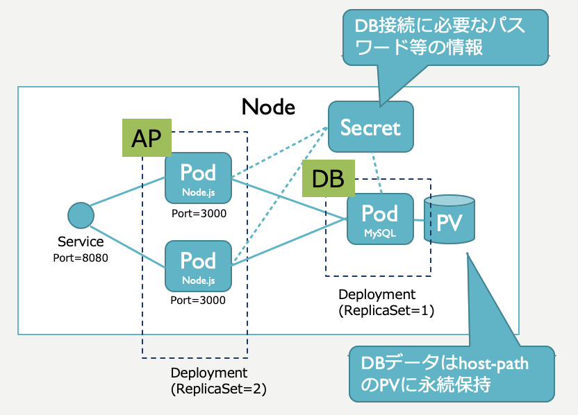

# k8s-web2

Web2階層サンプルです。<br>
POSTで受け付けたJSONをMySQLに格納し、GETでMySQLからJSONで取得します。

* フロントエンド(AP)：Node.js
* バックエンド(DB)：MySQL



## インストール手順
(1)Dockerイメージ作成
```
$ make build
```

(2)Secretの作成
```
$ vi k8s/db-secret.yaml
⇒dbuserとrootのパスワード(base64エンコードしたパスワード)を記入する。

$ kubectl apply -f k8s/db-secret.yaml
```

(3)PVの作成
```
$ kubectl apply -f k8s/db-pv-hostpath.yaml
```

(4)Pod生成
```
$ make deploy
```

## アンインストール手順
```
$ make clean
$ kubectl delete -f k8s/db-pv-hostpath.yaml
$ kubectl delete -f k8s/db-secret.yaml
```


## 動作確認用コマンド

```
$ curl localhost:8080
$ curl localhost:8080/api/fairies
$ curl -X POST -H "Content-Type: application/json" -d '{"name":"パピィ", "instrument":"鈴", "sweets":"キャンディ"}' localhost:8080/api/fairies
```

## MySQL接続手順

```
$ kubectl exec -it node-sample-db-xxxxxxxxxxxxxxx /bin/sh

# mysql -u root -p

mysql> USE mirumo-db
mysql> SELECT * FROM fairy;
```
